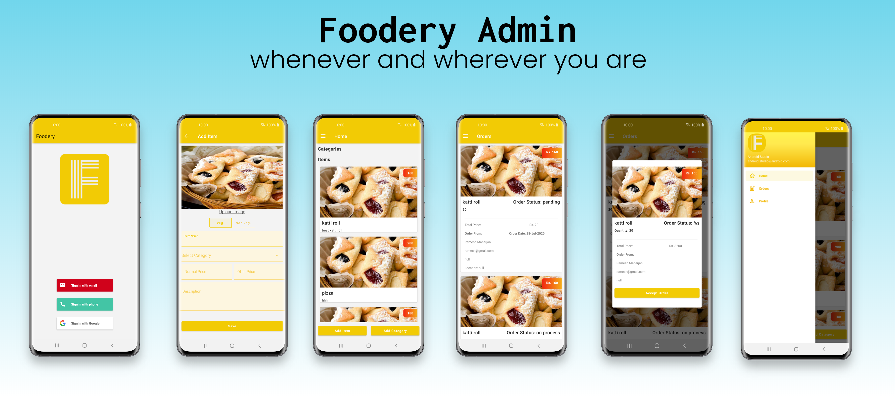

# Foodery Admin App

   

Manages foodery client 

## Project Features

- 100% Kotlin
- Model-View-ViewModel (MVVM)
- Single Activity Architecture
- Android Architecture Components
- Android Jetpack
- Reactive UI
- Testing
- Material Design
- Firebase

## Libraries

- Retrofit2
- Glide
